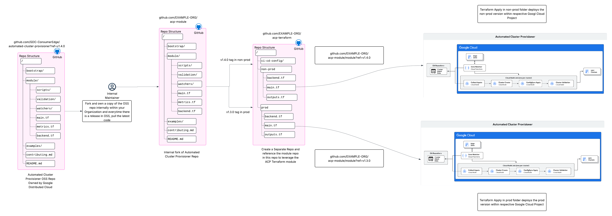
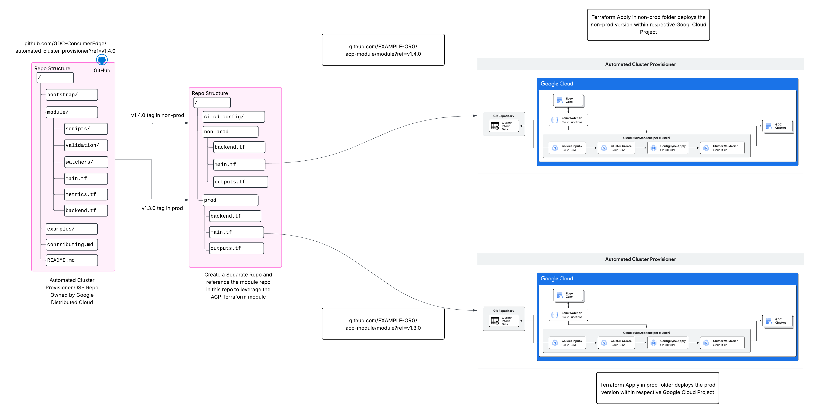

# Deployment Patterns

There are two primary approaches for deploying Automated Cluster Provisioner within your organization. Each offers a different balance of simplicity and control, allowing you to choose the best fit for your operational needs.

## Table of Contents
- [Option 1: Direct Module Consumption](#option-1-direct-module-consumption)
- [Option 2: Fork, Own, and Maintain](#option-2-fork-own-and-maintain)

---

## Option 1: Direct Module Consumption

This approach involves sourcing the Terraform module directly from the official Git repository. It is the simplest method to get started and ensures that you are using a specific, tagged version of the module. This is ideal for teams that do not require customizations to the core logic.

### High-Level Architecture


### How It Works
You reference the module in your Terraform configuration using a Git source address, pointing to a specific version via a tag.

#### Example:
```terraform
module "cluster_automation" {
  source                       = "git::https://github.com/GDC-ConsumerEdge/automated-cluster-provisioner.git?ref=v1.4.0"
  project_id                   = "sample-project-id"
  source_of_truth_repo         = "github.com/GDC-ConsumerEdge/automated-cluster-provisioner"
  git_secret_id                = "example-pat-token"
  # ... other variables
}
```

### Advantages
- **Simplicity:** Easy to set up and maintain.
- **Consistency:** Ensures you are using a well-defined version of the module.
- **Seamless Upgrades:** Upgrading to a new version is as simple as changing the `ref` tag in your Terraform configuration.

### Considerations
- **Limited Customization:** This approach does not allow for modifications to the module's core logic.

---

## Option 2: Fork, Own, and Maintain

This approach involves creating a fork of the official repository. This gives you complete control over the codebase, allowing you to introduce custom modifications and enhancements. This is the recommended approach for organizations with specific security, compliance, or feature requirements that are not met by the base module.

### High-Level Architecture


### How It Works
1.  **Fork the Repository:** Create a fork of the `automated-cluster-provisioner` repository into your own version control system (e.g., GitHub, GitLab).
2.  **Modify as Needed:** Make any necessary changes to the module's source code.
3.  **Reference Your Fork:** Update your Terraform configuration to source the module from your forked repository.

#### Example:
```terraform
module "cluster_automation" {
  source                       = "git::https://github.com/your-organization/automated-cluster-provisioner.git?ref=custom-branch-or-tag"
  project_id                   = "sample-project-id"
  source_of_truth_repo         = "github.com/your-organization/automated-cluster-provisioner"
  git_secret_id                = "example-pat-token"
  # ... other variables
}
```

### Advantages
- **Full Control:** Allows for complete customization of the module's logic.
- **Tailored Solutions:** Adapt the module to meet your organization's specific needs.
- **Security and Compliance:** Implement custom security controls and ensure compliance with internal policies.

### Considerations
- **Maintenance Overhead:** You are responsible for maintaining your fork, which includes pulling in updates from the upstream repository and resolving any merge conflicts.
- **Complexity:** Requires a deeper understanding of the module's architecture and dependencies.


## Terraform Details

### Providers

| Name | Version |
|------|---------|
| <a name="provider_archive"></a> [archive](#provider\_archive) | 2.4.2 |
| <a name="provider_google"></a> [google](#provider\_google) | 5.26.0 |
| <a name="provider_random"></a> [random](#provider\_random) | 3.6.1 |

### Modules

No modules.


### Inputs

| Name | Description | Type | Default | Required |
|------|-------------|------|---------|:--------:|
| <a name="input_environment"></a> [environment](#input\_environment) | Deployment environment. Used to build resource names to partition GCP resources if deploying multiple ACP instances into the same project. | `string` | `"stg"` | no |
| <a name="input_node_location"></a> [node\_location](#input\_node\_location) | default GDCE zone used by CloudBuild | `string` | n/a | yes |
| <a name="input_project_id"></a> [project\_id](#input\_project\_id) | The Google Cloud Platform (GCP) project id in which the solution resources will be provisioned | `string` | `"cloud-alchemists-sandbox"` | no |
| <a name="input_project_id_fleet"></a> [project\_id\_fleet](#input\_project\_id\_fleet) | Optional id of GCP project hosting the Google Kubernetes Engine (GKE) fleet or Google Distributed Compute Engine (GDCE) machines. Defaults to the value of 'project\_id'. | `string` | `null` | no |
| <a name="input_project_id_secrets"></a> [project\_id\_secrets](#input\_project\_id\_secrets) | Optional id of GCP project containing the Secret Manager entry storing Git repository credentials. Defaults to the value of 'project\_id'. | `string` | `null` | no |
| <a name="input_project_services"></a> [project\_services](#input\_project\_services) | GCP Service APIs (<api>.googleapis.com) to enable for this project | `list(string)` | <pre>[<br>  "cloudbuild.googleapis.com",<br>  "cloudfunctions.googleapis.com",<br>  "cloudscheduler.googleapis.com",<br>  "run.googleapis.com",<br>  "storage.googleapis.com"<br>]</pre> | no |
| <a name="input_project_services_fleet"></a> [project\_services\_fleet](#input\_project\_services\_fleet) | GCP Service APIs (<api>.googleapis.com) to enable for this project | `list(string)` | <pre>[<br>  "anthos.googleapis.com",<br>  "anthosaudit.googleapis.com",<br>  "anthosconfigmanagement.googleapis.com",<br>  "anthosgke.googleapis.com",<br>  "artifactregistry.googleapis.com",<br>  "cloudbuild.googleapis.com",<br>  "cloudfunctions.googleapis.com",<br>  "cloudresourcemanager.googleapis.com",<br>  "cloudscheduler.googleapis.com",<br>  "connectgateway.googleapis.com",<br>  "container.googleapis.com",<br>  "edgecontainer.googleapis.com",<br>  "gkeconnect.googleapis.com",<br>  "gkehub.googleapis.com",<br>  "gkeonprem.googleapis.com",<br>  "iam.googleapis.com",<br>  "iamcredentials.googleapis.com",<br>  "logging.googleapis.com",<br>  "monitoring.googleapis.com",<br>  "opsconfigmonitoring.googleapis.com",<br>  "run.googleapis.com",<br>  "secretmanager.googleapis.com",<br>  "serviceusage.googleapis.com",<br>  "stackdriver.googleapis.com",<br>  "storage.googleapis.com",<br>  "sts.googleapis.com"<br>]</pre> | no |
| <a name="input_project_services_secrets"></a> [project\_services\_secrets](#input\_project\_services\_secrets) | GCP Service APIs (<api>.googleapis.com) to enable for this project | `list(string)` | <pre>[<br>  "secretmanager.googleapis.com"<br>]</pre> | no |
| <a name="input_region"></a> [region](#input\_region) | GCP region to deploy resources | `string` | n/a | yes |
| <a name="input_source_of_truth_repo"></a> [source_of_truth_repo](#input\_source\_of\_truth\_repo) | Repository containing source of truth cluster intent registry | `string` | n/a | yes |
| <a name="input_source_of_truth_branch"></a> [source_of_truth_branch](#input\_source\_of\_truth\_branch) | Repository branch containing source of truth cluster intent registry | `string` | n/a | yes |
| <a name="input_source_of_truth_path"></a> [source_of_truth_path](#input\_source\_of\_truth\_path) | Path to cluster intent registry file in repository | `string` | n/a | yes |
| <a name="git_secret_id"></a> [git_secret_id](#input\_git\_secret\_id) | Git token to authenticate with source of truth | `string` | n/a | yes |
| <a name="cluster_creation_timeout"></a> [cluster_creation_timeout](#input\_cluster\_creation\_timeout) | Cloud Build timeout in seconds for cluster creation. This should account for time to create the cluster, configure core services (ConfigSync, Robin, VMRuntime, etc..), and time for any workload configuration needed before the health checks pass. | `number` | 28800 | no |
| <a name="cluster_creation_max_retries"></a> [cluster_creation_max_retries](#input\_cluster\_creation\_max\_retries) | The maximum number of retries upon cluster creation failure before marking the zone state as CUSTOMER_FACTORY_TURNUP_CHECKS_FAILED | `number` | 0 | no |
| <a name="default_config_sync_version"></a> [default_config_sync_version](#input\_default\_config\_sync\_version) | Sets a default ConfigSync version to use for provisioned clusters. If left empty, it will not specify a version at the cluster level. If empty, this will either install the fleet configured version or the latest version of ConfigSync. | `string` | "" | no |
| <a name="opt_in_build_messages"></a> [opt_in_build_messages](#input\_opt\_in\_build\_messages) | Opt in to sending build steps and failure messages to Google. These messages help Google provide support on issues during the provisioning process. | `bool` | false | no |

### Outputs

No outputs.

